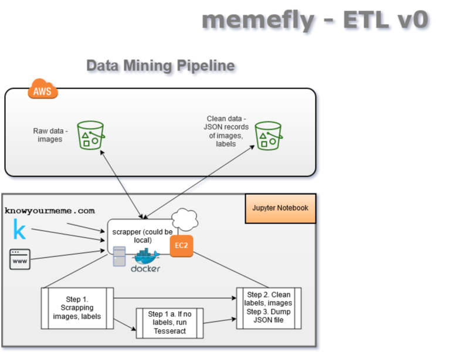
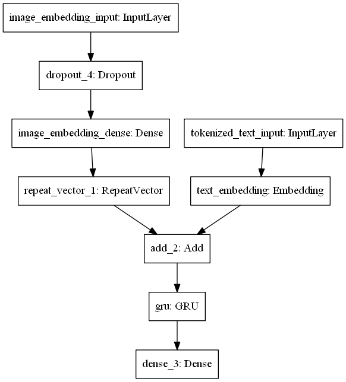
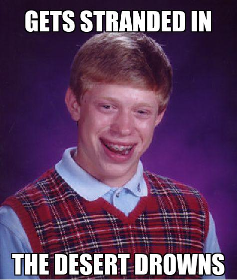
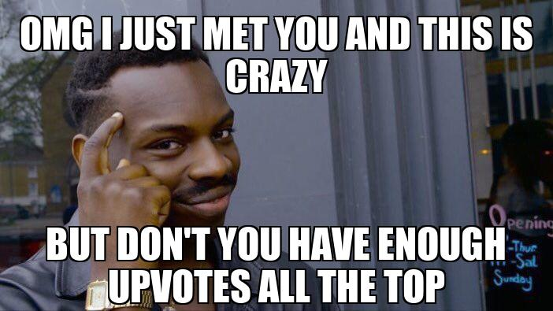

# Memefly

You can find the project at [https://memefly.netlify.com/](https://memefly.netlify.com/).

## Contributors

|                                       [Nick Buukhalter](https://github.com/Nburkhal)                                        |                                       [Harsh Desai](https://github.com/hurshd0)                                        |                                       [Han Lee](https://https://github.com/leehanchung)                                        |
| :-----------------------------------------------------------------------------------------------------------: | :-----------------------------------------------------------------------------------------------------------: | :-----------------------------------------------------------------------------------------------------------: |
|                                             |                                             |                                             |
|                                  |                         |                       |
|  |  |  |

## Project Overview

[Trello Board](https://trello.com/b/BLp7jI06/memefly)

[Product Canvas](https://www.notion.so/Memefly-4148c8ecbd3b4bcfb1c6624b2f28090d)

Automatic meme generation model using Tensorflow Keras. Model is Dockerized and served as a REST API with FastAPI/uvicorn ASGI endpoint. A separate serving model serving is done with a combination of FastAPI/uvicorn ASGI endpoint with models served using Tensorflow Serving on Sagemaker.

### Tech Stack

#### Python Packages
- Numpy
- Pandas
- Tensorflow
- FastAPI
- Selenium

#### DevOps
- Tensorflow Serving
- Docker
- MySQL
- MongoDB
- AWS ECR
- AWS Elastic Beanstalk
- AWS S3
- AWS Sagemaker

### Architecture

### Predictions

We used an encoder-decoder architecture for the meme generation task. Pre-trained Inception V3 architecture and weights are used as the encoder to extract embeddings from an input image. At the same time, we encode the texts into text embeddings and concat them together with image embeddings. For the decoder, we used GRU to to map the image and text embeddings to predict the next word in the text string. 

At training time, we repeat the same image embeddings as input and send in text sequences in order, e.g., 0. `this`, 1. `this is`, 2. `this is a`, 3. `this is a sequence`. The model will try to predict the next word in the sequence given the input image embedding and text embeddings. We denote the beginning and the end of a text sequence with `startseq` and `endseq`.

At inferencing time, we send in image embeddings and the seed token `startseq` to the model, and then repeatly send in the image embeddings and the prediction output of the previous timestep, until either we see `endseq` or reach maximum sentence length. To improve the quality of the output, we used beam search to greedily select the best N sentences. But it has to be noted that beam search is neither optimal nor complete algorithm.

To increase varieties, we tried 1) adding Guassian noise to the input image and 2) choosing top N sentence scores using beam search.

The architecture is summarized here:

### Individual Example Outputs

### Batch Example Outputs

### Explanatory Variables

-   Image
-   Text

### Data Sources

Please see [Data Engineering](./memefly-de/README.md) for details.

### Python Notebooks

[Training Notebook](./memefly-ml/notebooks/10_word_gen_model_3.2.2.ipynb)

[Inferencing Notebook](./memefly-ml/notebooks/11_word_gen_beam_search_3.2.2.ipynb)

### How to connect to the web API

Please see [Machine Learning Engineering - Deployment](./memefly-ds-app/README.md) for details.

### How to connect to the data API

Please see [Data Engineering](./memefly-de/README.md) for details.

## Contributing

When contributing to this repository, please first discuss the change you wish to make via issue, email, or any other method with the owners of this repository before making a change.

Please note we have a [code of conduct](./code_of_conduct.md). Please follow it in all your interactions with the project.

### Issue/Bug Request

 **If you are having an issue with the existing project code, please submit a bug report under the following guidelines:**
 - Check first to see if your issue has already been reported.
 - Check to see if the issue has recently been fixed by attempting to reproduce the issue using the latest master branch in the repository.
 - Create a live example of the problem.
 - Submit a detailed bug report including your environment & browser, steps to reproduce the issue, actual and expected outcomes,  where you believe the issue is originating from, and any potential solutions you have considered.

### Feature Requests

We would love to hear from you about new features which would improve this app and further the aims of our project. Please provide as much detail and information as possible to show us why you think your new feature should be implemented.

### Pull Requests

If you have developed a patch, bug fix, or new feature that would improve this app, please submit a pull request. It is best to communicate your ideas with the developers first before investing a great deal of time into a pull request to ensure that it will mesh smoothly with the project.

Remember that this project is licensed under the MIT license, and by submitting a pull request, you agree that your work will be, too.

#### Pull Request Guidelines

- Ensure any install or build dependencies are removed before the end of the layer when doing a build.
- Update the [README.md](./README.md) with details of changes to the interface, including new plist variables, exposed ports, useful file locations and container parameters.
- Ensure that your code conforms to our existing code conventions and test coverage.
- Include the relevant issue number, if applicable.
- You may merge the Pull Request in once you have the sign-off of two other developers, or if you do not have permission to do that, you may request the second reviewer to merge it for you.

### Attribution

These contribution guidelines have been adapted from [this good-Contributing.md-template](https://gist.github.com/PurpleBooth/b24679402957c63ec426).

## Documentation

See [Data Engineering](./memefly-de/README.md) for details on the data engineering of our project.

See [Machine Learning Engineering - Training](./memefly-ml/README.md) for details on the training part of our project.

See [Machine Learning Engineering - Deployment](./memefly-ds-app/README.md) for details on the deployment of our project.

